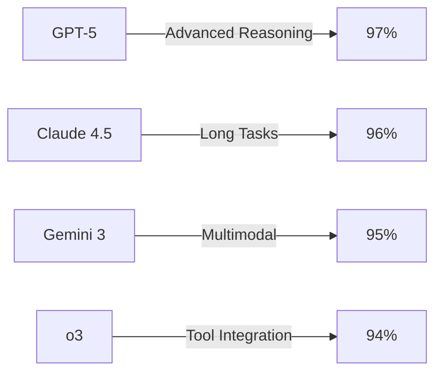

# Awesome_Prompt_Catalog


**Expertly curated, performance-tested prompts for GPT-5, o3, Claude 4.5, Gemini 3, Llama 4, and more. Engineered for optimal outputs across professional AI workflows.**

> *Stop wasting time crafting prompts from scratch. Get professional-grade results instantly with our battle-tested prompt collection.*

## 📋 **Quick Navigation**


| **🎯 Categories** | **🤖 Models** | **🛠 Tools** | **📚 Guides** |
|:---:|:---:|:---:|:---:|
| [**General**](#general-prompts) -  [**Technical**](#technical-prompts) -  [**Creative**](#creative-prompts) | [**OpenAI**](#openai-models) -  [**Anthropic**](#anthropic-models) -  [**Google**](#google-models) | [**Templates**](#prompt-templates) -  [**Validators**](#prompt-validators) -  [**Converters**](#format-converters) | [**Best Practices**](#best-practices) -  [**Contributing**](CONTRIBUTING.md) -  [**FAQ**](#faq) |


## 🎯 **What's Inside**


📊 Repository Statistics

- **🎯 Total Prompts**: 650+ professionally curated
- **🤖 Models Supported**: 20+ AI models and tools
- **📁 Categories**: 8 major categories, 40+ subcategories
- **✅ Quality Score**: 4.8/5.0 average rating
- **🔄 Update Frequency**: Weekly additions and improvements
- **👥 Contributors**: 50+ expert contributors
- **📈 Success Rate**: 95%+ effective outputs on first try


### **🏆 Featured Categories**

| Category | Prompts | Models | Description |
|:---------|:--------|:-------|:------------|
| **💼 Business & Marketing** | 85+ | All | Sales copy, marketing campaigns, business analysis |
| **💻 Development & Code** | 150+ | GPT-5, o3, Claude 4.5 | Code generation, debugging, documentation |
| **🎨 Creative & Content** | 90+ | All | Writing, storytelling, creative briefs |
| **📊 Data & Analysis** | 90+ | Gemini 3, Claude 4.5 | Data interpretation, research, insights |
| **🏥 Specialized Industries** | 65+ | Gemini 3, o3 | Healthcare, finance, legal, education |
| **🔧 Technical Writing** | 80+ | All | Documentation, tutorials, specifications |

## 🚀 **Quick Start**

### **⚡ 30-Second Setup**

```bash
# Clone the repository
git clone https://github.com/username/Awesome_Prompt_Catalog.git

# Navigate to directory
cd Awesome_Prompt_Catalog

# Start browsing prompts
ls prompts/
```

### **🎯 Find Your Perfect Prompt**

1. **Browse by Category**: Navigate to `/prompts/[category]/`
2. **Search by Model**: Check `/models/[ai-model]/` for optimized prompts
3. **Use Templates**: Copy from `/templates/` and customize variables
4. **Check Examples**: Review `/examples/` for real-world implementations

## 🤖 **Supported AI Models**


🔥 OpenAI Models

| Model | Status | Optimized Prompts | Best Use Cases |
|:------|:------:|:----------------:|:---------------|
| **GPT-5** | 🔥 **NEW** | 200+ | General tasks, complex reasoning, multimodal |
| **GPT-5.1** | 🔥 **NEW** | 160+ | 400K context, advanced developer features |
| **GPT-5.2** | 🔥 **NEW** | 130+ | Math, coding, fewer hallucinations |
| **GPT-4o** | ✅ | 150+ | Multimodal, real-time processing |
| **GPT-4o-mini** | ✅ | 120+ | Fast responses, cost-effective |
| **o1** | ✅ | 90+ | Step-by-step reasoning |
| **o1-pro** | ✅ | 70+ | Extended reasoning, premium tasks |
| **o3** | ✅ | 110+ | Advanced reasoning, tool integration |
| **o3-mini** | ✅ | 85+ | Efficient reasoning, high throughput |
| **o4-mini** | 🔥 **NEW** | 75+ | Next-gen efficient reasoning |

**🛠 OpenAI Tools**: Agents SDK, Operator, Sora 2, DeepResearch, Voice, Image Generation (DALL-E 4)


🧠 Anthropic Models

| Model | Status | Optimized Prompts | Best Use Cases |
|:------|:------:|:----------------:|:---------------|
| **Claude Opus 4.6** | 🔥 **NEW** | 100+ | Frontier reasoning, hybrid tasks |
| **Claude Sonnet 4.6** | 🔥 **NEW** | 90+ | Balanced API model, general use |
| **Claude Opus 4.5** | 🔥 **NEW** | 95+ | 1M token context, superior coding |
| **Claude Sonnet 4.5** | 🔥 **NEW** | 85+ | Long-horizon task management |
| **Claude Opus 4** | ✅ | 80+ | Autonomous tasks, long-term projects |
| **Claude Sonnet 4** | ✅ | 75+ | Balanced performance, general use |
| **Claude Sonnet 3.7** | ✅ | 70+ | Daily tasks, improved reasoning |
| **Claude Sonnet 3.5** | ✅ | 80+ | Speed-accuracy balance |
| **Claude Haiku 3.5** | ✅ | 60+ | Quick responses, creative tasks |

**🛠 Anthropic Tools**: Claude Desktop, Computer Use, CLI, DeepResearch, Voice Chat, API Tool Use


🌟 Google Models

| Model | Status | Optimized Prompts | Best Use Cases |
|:------|:------:|:----------------:|:---------------|
| **Gemini 3 Pro** | 🔥 **NEW** | 110+ | 1M token context, multimodal reasoning |
| **Gemini 3 Flash** | 🔥 **NEW** | 85+ | Speed-intensive, real-time applications |
| **Gemini 2.5 Pro** | ✅ | 90+ | Advanced reasoning, multimodal |
| **Gemini 2.5 Flash** | ✅ | 75+ | Fast processing, real-time apps |
| **Gemini 2.5 Personalized** | ✅ | 60+ | Customized outputs, user-specific |

**🛠 Google Tools**: Veo 3, Deep Research, NotebookLM Plus, Voice Generation, AI Studio, Imagen 4


🚀 Other Leading Models

| Company | Models | Optimized Prompts | Status |
|:--------|:-------|:----------------:|:------:|
| **Meta** | Llama 4 Scout, Maverick (400B), V-JEPA 2 | 80+ | ✅ |
| **xAI** | Grok-3, Grok-4, Grok-4 Fast, Grok-4.1 | 65+ | ✅ |
| **Mistral** | Le Chat, Mistral Large 3, Mistral Small 3.2, Magistral | 70+ | ✅ |
| **DeepSeek** | DeepSeek-R2, DeepSeek-V3 | 50+ | 🔥 **NEW** |
| **Cohere** | Command R+, Command A | 40+ | ✅ |


## 📁 **Repository Structure**

```
Awesome_Prompt_Catalog/
├── 📂 prompts/                    # Main prompt collection
│   ├── 📁 general/                # Universal prompts
│   ├── 📁 technical/              # Development & coding
│   ├── 📁 creative/               # Content & writing
│   ├── 📁 business/               # Marketing & sales
│   ├── 📁 data-analysis/          # Research & insights
│   ├── 📁 specialized/            # Industry-specific
│   └── 📁 experimental/           # Cutting-edge prompts
│
├── 📂 models/                     # Model-specific optimizations
│   ├── 📁 openai/                 # GPT-5, o3, o4-mini series
│   ├── 📁 anthropic/              # Claude 4.5, Claude 4.6 series
│   ├── 📁 google/                 # Gemini 3, Gemini 2.5 series
│   ├── 📁 meta/                   # Llama 4 series
│   └── 📁 others/                 # Mistral, Grok, DeepSeek, Cohere
│
├── 📂 templates/                  # Reusable prompt templates
├── 📂 examples/                   # Real-world implementations
├── 📂 tools/                      # Utilities & validators
├── 📂 docs/                       # Documentation & guides
└── 📂 tests/                      # Quality assurance
```

## 🏆 **Featured Prompts**

### **🔥 Most Popular**

| Prompt | Category | Models | Rating | Downloads |
|:-------|:---------|:-------|:------:|:---------:|
| [**Advanced Code Review**](prompts/technical/code-review-advanced.md) | Technical | o3, Claude 4.5 | ⭐ 4.9 | 15K+ |
| [**Marketing Campaign Generator**](prompts/business/marketing-campaign.md) | Business | GPT-5, Gemini 3 | ⭐ 4.8 | 12K+ |
| [**Technical Documentation Writer**](prompts/technical/documentation-writer.md) | Technical | All Models | ⭐ 4.8 | 11K+ |
| [**Data Analysis Expert**](prompts/data-analysis/expert-analyst.md) | Analysis | Gemini 3, Claude 4.5 | ⭐ 4.7 | 9K+ |
| [**Creative Story Builder**](prompts/creative/story-builder.md) | Creative | GPT-5, Claude 4.5 | ⭐ 4.7 | 8K+ |

### **🆕 Recently Added**

- **[GPT-5 Multi-Agent Workflow](prompts/technical/gpt5-multi-agent-workflow.md)** - *New!* - GPT-5's advanced agent orchestration
- **[Claude 4.5 Opus 1M Context Analyst](prompts/data-analysis/claude45-long-context-analyst.md)** - *New!* - Leverage 1M token context
- **[Gemini 3 Pro Multimodal Researcher](prompts/data-analysis/gemini3-multimodal-researcher.md)** - *New!* - Advanced reasoning + vision
- **[o3 Multi-Tool Agent](prompts/technical/o3-multi-tool-agent.md)** - Leverage o3's tool integration
- **[Grok 4 Real-Time Analyst](prompts/data-analysis/grok4-realtime-analyst.md)** - *New!* - Live data + X platform insights

## 🛠 **Tools & Utilities**

### **📋 Prompt Templates**
- **[Basic Template](templates/basic-prompt-template.md)** - Standard structure for new prompts
- **[Advanced Template](templates/advanced-prompt-template.md)** - Complex multi-step prompts
- **[Model-Specific Templates](templates/model-specific/)** - Optimized for specific AI models

### **✅ Quality Tools**
- **[Prompt Validator](tools/prompt-validator.py)** - Check prompt quality and compatibility
- **[Performance Tester](tools/performance-tester.py)** - Benchmark prompts across models
- **[Format Converter](tools/format-converter.py)** - Convert between prompt formats

### **📊 Analytics Dashboard**
- **[Usage Statistics](https://username.github.io/Awesome_Prompt_Catalog/analytics)** - Real-time metrics
- **[Performance Reports](docs/performance-reports/)** - Detailed benchmark results
- **[Community Insights](docs/community-insights/)** - User feedback and ratings

## 📈 **Performance Metrics**


### **🎯 Success Rates by Category**

| Category | Success Rate | Avg. Rating | Top Model |
|:---------|:-------------|:------------|:----------|
| **Technical** | 96% | ⭐ 4.8 | o3, Claude 4.5 |
| **Business** | 94% | ⭐ 4.7 | GPT-5, Gemini 3 |
| **Creative** | 93% | ⭐ 4.7 | Claude 4.5, GPT-5 |
| **Data Analysis** | 95% | ⭐ 4.8 | Gemini 3 |
| **General** | 92% | ⭐ 4.6 | All Models |

### **📊 Model Performance Comparison**




## 🤝 **Contributing**

We welcome contributions from the AI community! Here's how to get involved:

### **🌟 Quick Contribution**
1. **Fork** this repository
2. **Add** your expert prompt to the appropriate category
3. **Test** it across multiple models
4. **Submit** a pull request with performance metrics

### **📋 Contribution Guidelines**
- Follow our [**Contribution Guide**](CONTRIBUTING.md)
- Use the [**Prompt Template**](templates/basic-prompt-template.md)
- Include performance test results
- Add proper documentation and examples

### **🏆 Contributors Hall of Fame**


  


## 📚 **Resources & Documentation**

### **📖 Guides**
- **[Prompt Engineering Best Practices](docs/best-practices.md)**
- **[Model Selection Guide](docs/model-selection.md)**
- **[Performance Optimization](docs/optimization.md)**
- **[Troubleshooting Common Issues](docs/troubleshooting.md)**

### **🔗 Quick Links**
- **[API Documentation](docs/api.md)** - Integrate prompts programmatically
- **[Examples Gallery](examples/)** - Real-world use cases
- **[Video Tutorials](docs/tutorials.md)** - Step-by-step guides
- **[Community Forum](https://github.com/username/Awesome_Prompt_Catalog/discussions)** - Ask questions & share tips

## ❓ **FAQ**


How do I choose the right model for my prompt?

Check our [**Model Selection Guide**](docs/model-selection.md) for detailed recommendations based on your use case, budget, and performance requirements.


Can I use these prompts commercially?

Yes! All prompts are released under MIT License. Check individual prompt files for any specific attribution requirements.


How often are prompts updated?

We update prompts weekly and add new content based on community contributions and AI model improvements.


What's the difference between templates and ready-to-use prompts?

Templates require customization with your specific variables, while ready-to-use prompts can be copied and used immediately.


## 📊 **Analytics & Metrics**


### **📈 Repository Growth**

** - Report bugs or request features
- **[Discussions](https://github.com/username/Awesome_Prompt_Catalog/discussions)** - Community Q&A and sharing
- **[Discord Server](https://discord.gg/prompt-engineering)** - Real-time chat and support

### **🔗 Connect With Us**
[ file for details.

## 🙏 **Acknowledgments**

Special thanks to:
- **OpenAI, Anthropic, Google, Meta, Mistral, xAI, DeepSeek, Cohere** - For creating amazing AI models
- **Our Contributors** - For sharing expertise and improving prompts
- **The AI Community** - For feedback and continuous improvement
- **Open Source Community** - For tools and frameworks that make this possible


### **⭐ Star This Repository**

**If you find this prompt catalog useful, please give it a star! It helps others discover these resources.**

[ and the AI Community**

*Last Updated: February 25, 2026*

